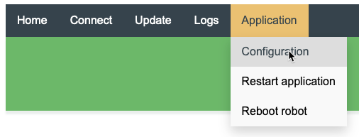

# iRobot Create 3

The Basic Hardware and Software information are shown on the [Documentation Website](https://iroboteducation.github.io/create3_docs/).

And the original [Create 3 Robot Project Code](https://github.com/iRobotEducation/irobot-edu-python-sdk/tree/main/examples/root_robots) is stored in Github. There are also some examples there.

The first step is to connect the robot to the WLAN network and update the firmware. To do that, we need to follow the [setup guidance](https://edu.irobot.com/create3-setup).

It is also possible to play around with iRobot Create 3 with an online [Coding Platform](https://python.irobot.com/) using Python.

# WIFI Connection and basic Configuration

The first step is to connect the Pi5 to the iRobot, see please this tutorial ([https://jimbobbennett.dev/blogs/irobot-create3-connect-a-pi/](https://jimbobbennett.dev/blogs/irobot-create3-connect-a-pi/)). In this case, we do not have to connect the Robot itself to the WiFi. 

After properly setting the RMW on both the Robot and Pi5 ([https://iroboteducation.github.io/create3_docs/setup/xml-config/](https://iroboteducation.github.io/create3_docs/setup/xml-config/)), which we use `fastrtps` for now, still **remember to switch the bottom on the [Adapter board](https://iroboteducation.github.io/create3_docs/hw/adapter/) to the USB side.** 

If it comes up with a Problem when you test with `ros2 action list` try to connect the robot to its wifi and **reboot the Robot, it does help a lot!**

# Create3 with Rasp Pi

[https://edu.irobot.com/learning-library/connect-create-3-to-raspberry-pi](https://edu.irobot.com/learning-library/connect-create-3-to-raspberry-pi)

# Use QEMU to Run original image

Follow this instruction:

[https://hub.docker.com/r/tonistiigi/binfmt?source=post_page-----208929004510--------------------------------](https://hub.docker.com/r/tonistiigi/binfmt?source=post_page-----208929004510--------------------------------)

